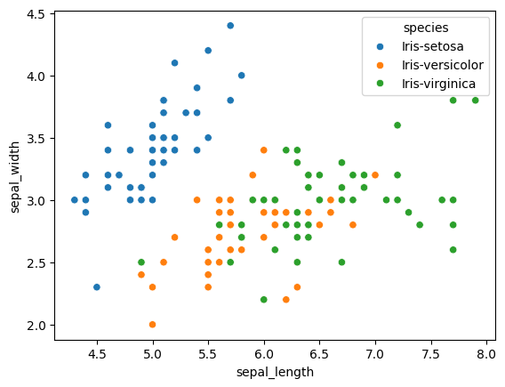
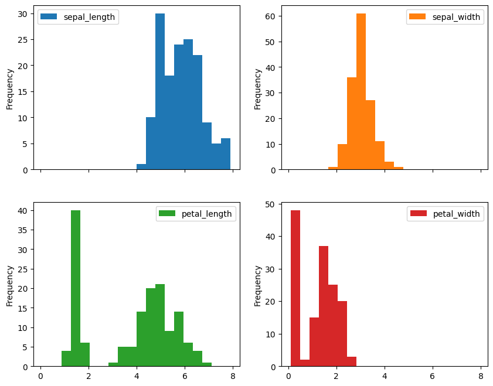

# 🌸 Iris Flower EDA

An exploratory data analysis (EDA) project on the famous Iris flower dataset. This notebook dives into the patterns, relationships, and statistics of the dataset's features to understand the characteristics of different Iris flower species.

---

## 📂 Project Structure

```
├── IRIS_flower_classification.ipynb     # Jupyter notebook with full EDA
├── README.md                            # Project description
```

## 📌 Objective

To explore the Iris dataset using Python libraries and extract meaningful insights by analyzing and visualizing feature distributions and relationships.

---

## 🔍 What’s Inside

* Dataset overview and feature descriptions
* Group-wise statistics
* Data visualizations:

  * Scatter plots
  * Line plots
  * Histograms
  * KDE plots
  * Box plots
  * Heatmaps

---

## Images
* ScatterPlot


* HistPlot Frequency 


---

## 🛠️ Tech Stack

* Python 🐍
* Jupyter Notebook 📓
* Pandas & NumPy 🧮
* Seaborn & Matplotlib 📈

---

## 🚀 Getting Started

1. Clone the repository:

   ```bash
   git clone https://github.com/OnlineBunker/iris-flower.git
   ```

2. Launch the notebook:

   ```bash
   jupyter notebook IRIS_flower_classification.ipynb
   ```

---

## 📊 Dataset Info

The Iris dataset contains 150 samples of iris flowers, with the following features:

* Sepal Length
* Sepal Width
* Petal Length
* Petal Width
* Species (Setosa, Versicolor, Virginica)

---

## ✅ Insights

* Visual relationships between different features
* Distribution patterns by species
* Group-wise feature comparisons

---

## 🤝 Contributing

Suggestions and contributions are welcome! Fork the repo and create a pull request.

---

> "Good data analysis lays the foundation for great machine learning."
